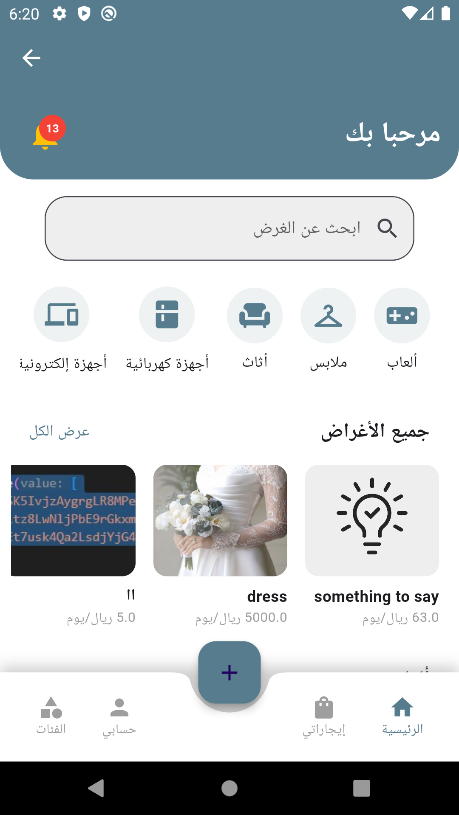
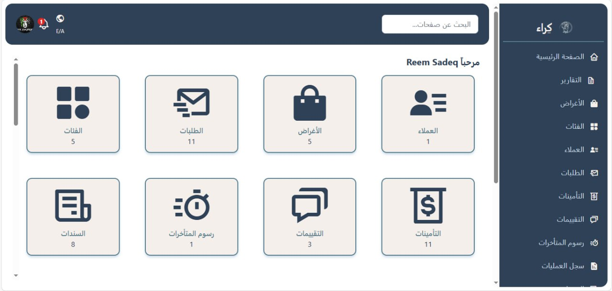

# 🚗 نظام كراء للتأجير | Rental Management System

## 📌 نبذة عن المشروع | About the Project

### العربية
نظام كراء للتأجير هو تطبيق موبايل يهدف إلى تسهيل إدارة عمليات التأجير من خلال توفير منصة متكاملة لإدارة العملاء والعقود والمدفوعات والأصول المؤجرة بطريقة سهلة وآمنة.

### English
Rental Management System is a mobile application designed to simplify rental operations by providing an integrated platform for managing customers, contracts, payments, and rental assets in a secure and user-friendly way.

---

## 🎯 أهداف المشروع | Project Objectives

### العربية
- أتمتة عمليات التأجير وإدارة العقود.
- تسهيل إدارة العملاء.
- متابعة المدفوعات والإيرادات.
- تقليل الأخطاء الناتجة عن الإدارة اليدوية.
- توفير واجهة استخدام سهلة وسريعة.

### English
- Automate rental and contract management processes.
- Simplify customer management.
- Track payments and revenues.
- Reduce errors caused by manual management.
- Provide an easy and intuitive user experience.

---

## 🛠️ التقنيات المستخدمة | Technologies Used

### Frontend (Mobile Application)
- Flutter
- Dart

### Backend (API)
- Laravel
- PHP

### Database
- MySQL

### Tools
- Visual Studio Code
- Android Studio
- Postman
- Git & GitHub

---

## ✨ المميزات | Features

### العربية
- تسجيل الدخول وإدارة الحسابات.
- إدارة العملاء.
- إدارة الأصول أو العناصر المتاحة للتأجير.
- إنشاء وإدارة عقود التأجير.
- متابعة المدفوعات.
- عرض التقارير والإحصائيات.
- واجهة سهلة الاستخدام.

### English
- User authentication and account management.
- Customer management.
- Rental asset management.
- Rental contract creation and management.
- Payment tracking.
- Reports and statistics.
- User-friendly interface.

---

## 📱 صور من التطبيق | Application Screenshots

### Home Screen


### Login Screen


### Dashboard


> قم باستبدال الصور بالصور الحقيقية من مشروعك.

---

## 🎥 فيديو توضيحي | Demo Video

يمكن مشاهدة الفيديو من خلال الرابط التالي:

You can watch the project demonstration video here:

[Demo Video Link](https://your-video-link-here.com)

---

## 🗄️ قاعدة البيانات | Database

يستخدم المشروع قاعدة بيانات MySQL لتخزين:

- بيانات المستخدمين
- بيانات العملاء
- العقود
- المدفوعات
- الأصول المؤجرة

The system uses MySQL to store:

- Users
- Customers
- Contracts
- Payments
- Rental Assets

---

## 🚀 تشغيل المشروع | Installation & Setup

### 1️⃣ Clone Repository

```bash
git clone https://github.com/your-username/rental-management-system.git
```

---

### 2️⃣ Flutter Setup

```bash
cd flutter_app

flutter pub get

flutter run
```

---

### 3️⃣ Laravel Setup

```bash
cd laravel_api

composer install

cp .env.example .env

php artisan key:generate

php artisan migrate

php artisan serve
```

---

## 📂 هيكل المشروع | Project Structure

```text
Rental-Management-System/
│
├── flutter_app/
│   ├── lib/
│   ├── assets/
│   └── pubspec.yaml
│
├── laravel_api/
│   ├── app/
│   ├── routes/
│   ├── database/
│   └── artisan
│
├── docs/
│   ├── screenshots/
│   ├── report.pdf
│   └── presentation.pdf
│
├── database/
│   └── schema.sql
│
└── README.md
```

---

## 👥 فريق العمل | Team Members

| Name | Role |
|--------|--------|
| Member 1 | Flutter Developer |
| Member 2 | Laravel Developer |
| Member 3 | Database Designer |
| Member 4 | Project Manager |

---

## 📄 التوثيق | Documentation

يتوفر التوثيق الكامل للمشروع داخل مجلد:

```text
docs/
```

ويشمل:

- تقرير المشروع
- مخطط قاعدة البيانات
- لقطات الشاشة
- العرض التقديمي

---

## 🔒 ملاحظات أمنية | Security Notes

لا تقم برفع الملفات التالية إلى GitHub:

```text
.env
vendor/
node_modules/
storage/logs/
build/
.dart_tool/
```

---

## 📜 License

This project is developed for educational and academic purposes.

هذا المشروع تم تطويره لأغراض تعليمية وأكاديمية.

---

## ⭐ Support

إذا أعجبك المشروع لا تنسَ وضع ⭐ للمستودع.

If you like this project, don't forget to leave a ⭐ on the repository.
